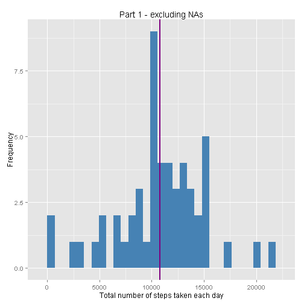
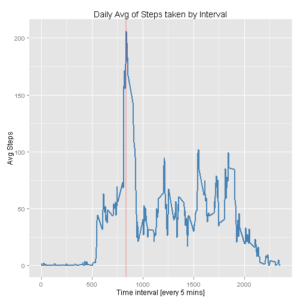
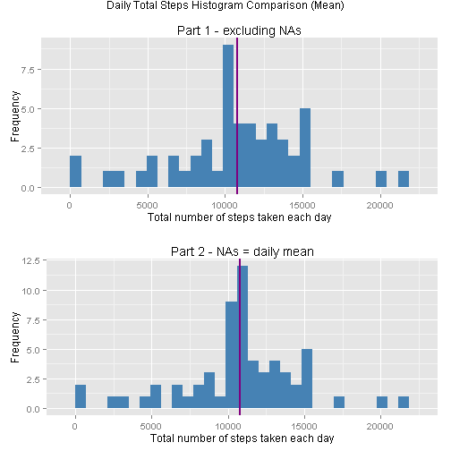
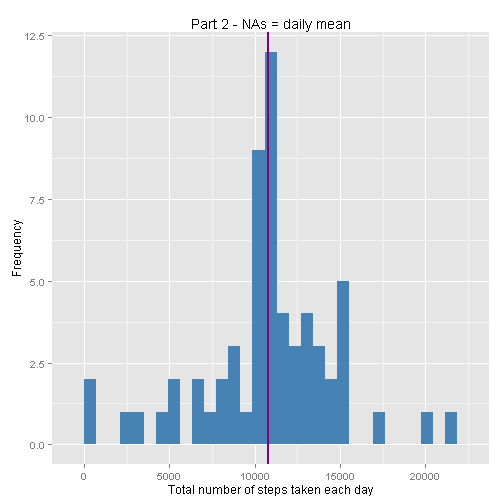
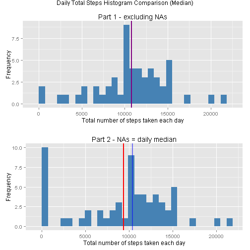
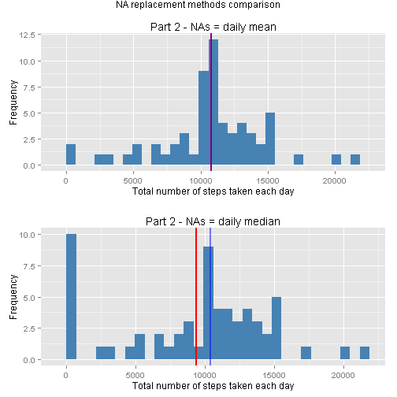
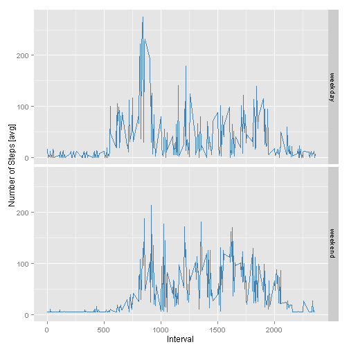

#Reproducible Research: Peer Assessment 1

==========================================


This is my **'Hello World'** RMardown - coincidentally it is also the first Peer Assessment of the Reproducible Research course of Coursera's Data Science Specialization. Let's see how it goes! 


## Loading and preprocessing the data

The first step will get that our **tidy data**. Assuming our raw data is stored within *activity.zip* we are going to use the *unz* function inside *read.table*. Please note that you can also use *read.csv* instead and save yourself from typing the additional arguments *header* and *sep*. We then use *as.Date* to convert the date column. 


```r
data <- read.table(unz("activity.zip", "activity.csv"), header = TRUE, sep=",")
data$date <- as.Date(data$date, format = "%Y-%m-%d")
```

Let's load the packages we are going to use before doing any further calculations.


```r
library(dplyr)
library(ggplot2)
library(gridExtra)
```


## What is mean total number of steps taken per day?

Now that we have our data and libraries loaded we are going to plot a histogram and calculate the mean and the median for our data excluding the NA values following these steps:

1.  Create a new dataset excluding NAs using *complete.cases* function
2.  Since we are looking to obtain the mean total number of steps per day we are going to use *group_by* function to group the dataset by days
3.  Now we just pass *summarize* function to obtain **total** steps per day
4.  We'll use qplot to create a histogram. Note that we are passing various aesthetic arguments.
5.  By using *summary* function for the values calculated in step 4 we obtain the mean and median.
6.  As an additional step, let's include the values calculated in 5 in our histogram to have a visual representation of their position


```r
data2 <- data[complete.cases(data),]
data2 <- group_by(data2, date)
dailysteps <- summarize(data2, total = sum(steps))
plot1 <- qplot(total, data = dailysteps) + geom_histogram(fill = "steelblue") + labs(x = "Total number of steps taken each day", y = "Frequency", title = "Daily Total Steps Histogram")
plot1
```

 

```r
summary(dailysteps$total)
```

```
##    Min. 1st Qu.  Median    Mean 3rd Qu.    Max. 
##      41    8841   10760   10770   13290   21190
```

```r
plot1_annotations <- plot1 + geom_vline(aes(xintercept = mean(dailysteps$total)), colour = "red", size = 1) + geom_vline(aes(xintercept = median(dailysteps$total)), colour = "blue", size = 1, alpha = .5) + labs(title ="Part 1 - excluding NAs")
plot1_annotations
```

 


## What is the average daily activity pattern?

Similar to the previous *code chunk* we are going to *group_by* interval; *summarize* to obtain **mean**; and plot using ggplot. In the next lines after the plot, the code calculates the Interval with the Max value and adds a vertical line in the plot.


```r
data3 <- group_by(data2,interval)
avgsteps <- summarize(data3, avg = mean(steps))
g <- ggplot(avgsteps,aes(x = interval, y = avg))
plot2 <- g + geom_line(size = 1, colour = "steelblue") + labs(x = "Time interval [every 5 mins]", y = "Avg Steps", title = "Daily Avg of Steps taken by Interval")
plot2
```

 

```r
max_step_interval <- avgsteps[avgsteps$avg==max(avgsteps$avg),]
max_step_interval
```

```
## Source: local data frame [1 x 2]
## 
##   interval      avg
## 1      835 206.1698
```

```r
plot2 + geom_vline(aes(xintercept = max_step_interval$interval), colour = "red", size = 1, alpha = .2)
```

 

## Imputing missing values

There are multiple different ways to replace the NA values (*mean, median, mode, min, max, etc...*). In the next *code chunk* we are going repeat the histogram part explained above and explore only two replacement options: the **mean** and the **median** for each day. But let's find out first how many missing values there are:


```r
missing <- count(data[complete.cases(data)==FALSE,])
missing
```

```
## Source: local data frame [1 x 1]
## 
##      n
## 1 2304
```

Using **mean** as replacement


```r
newdata <- data
newdata["steps"][is.na(newdata["steps"])] <- mean(data2$steps)
newdata2 <- group_by(newdata, date)
dailysteps2 <- summarize(newdata2, total = sum(steps))
plot3 <- qplot(total, data = dailysteps2) + geom_histogram(fill = "steelblue") + labs(x = "Total number of steps taken each day", y = "Frequency", title = "Daily Total Steps Histogram")
summary(dailysteps2$total)
```

```
##    Min. 1st Qu.  Median    Mean 3rd Qu.    Max. 
##      41    9819   10770   10770   12810   21190
```

```r
plot3_annotations <- plot3 + geom_vline(aes(xintercept = mean(dailysteps2$total)), colour = "red", size = 1) + geom_vline(aes(xintercept = median(dailysteps2$total)), colour = "blue", size = 1, alpha = .5) + labs(title ="Part 2 - NAs = daily mean")
grid.arrange(plot1_annotations,plot3_annotations, nrow = 2, main = "Daily Total Steps Histogram Comparison (Mean)")
```

 

```r
plot3_annotations
```

 

Using **median** as replacement


```r
newdata_median <- data
newdata_median["steps"][is.na(newdata_median["steps"])] <- median(data2$steps)
newdata_median2 <- group_by(newdata_median, date)
dailysteps3 <- summarize(newdata_median2, total = sum(steps))
plot4 <- qplot(total, data = dailysteps3) + geom_histogram(fill = "steelblue") + labs(x = "Total number of steps taken each day", y = "Frequency", title = "Daily Total Steps Histogram")
plot4_annotations <- plot4 + geom_vline(aes(xintercept = mean(dailysteps3$total)), colour = "red", size = 1) + geom_vline(aes(xintercept = median(dailysteps3$total)), colour = "blue", size = 1, alpha = .5) + labs(title ="Part 2 - NAs = daily median")
grid.arrange(plot1_annotations,plot4_annotations, nrow = 2, main = "Daily Total Steps Histogram Comparison (Median)")
```

 

Lastly, lets compare the histogram distribution of both replacement options:


```r
grid.arrange(plot3_annotations,plot4_annotations, nrow = 2, main = "NA replacement methods comparison")
```

 


## Are there differences in activity patterns between weekdays and weekends?

As the mean seemed to have the less impact in the histogram distribution we are going to continue this assessment using the mean as replacement. The last part of this assessment is to compare the average steps walked by interval and split that into either weekday or weekend. The following *code chunk* will:

1.  Add a new colum *day* using the date a as a reference
2.  *filter* the dataset by weekday/weekend, *group_by* interval, *summarize* to obtain **total_steps** and *mutate* to add a new variable call **week** to identify between weekday and weekend
3.  Use *rbind* to append the tables created in step 2 into one single table
4.  Use ggplot + facet_grid to create a line plot by the variable **week**


```r
data_day <- mutate(newdata, day = weekdays(date, abbreviate = TRUE))
weekday <- c("Mon","Tue","Wed","Thu","Fri")
weekend <- c("Sat","Sun")
day_weekend <- filter(data_day, day == weekend) %>% group_by(interval) %>% summarize(total_steps = mean(steps)) %>% mutate(week = c("weekend"))
day_weekday <- filter(data_day, day == weekday) %>% group_by(interval) %>% summarize(total_steps = mean(steps)) %>% mutate(week = c("weekday"))
day_data <- rbind(day_weekday,day_weekend)
g<-ggplot(data = day_data, aes(interval,total_steps))
g + geom_line(colour = "steelblue") + facet_grid(week~.) + labs(x = "Interval", y = "Number of Steps [avg]", main = "Average Steps per time interval (grouped by weekday/weekend)" )
```

 

And I believe that's all. Thanks and good luck to you too! 
